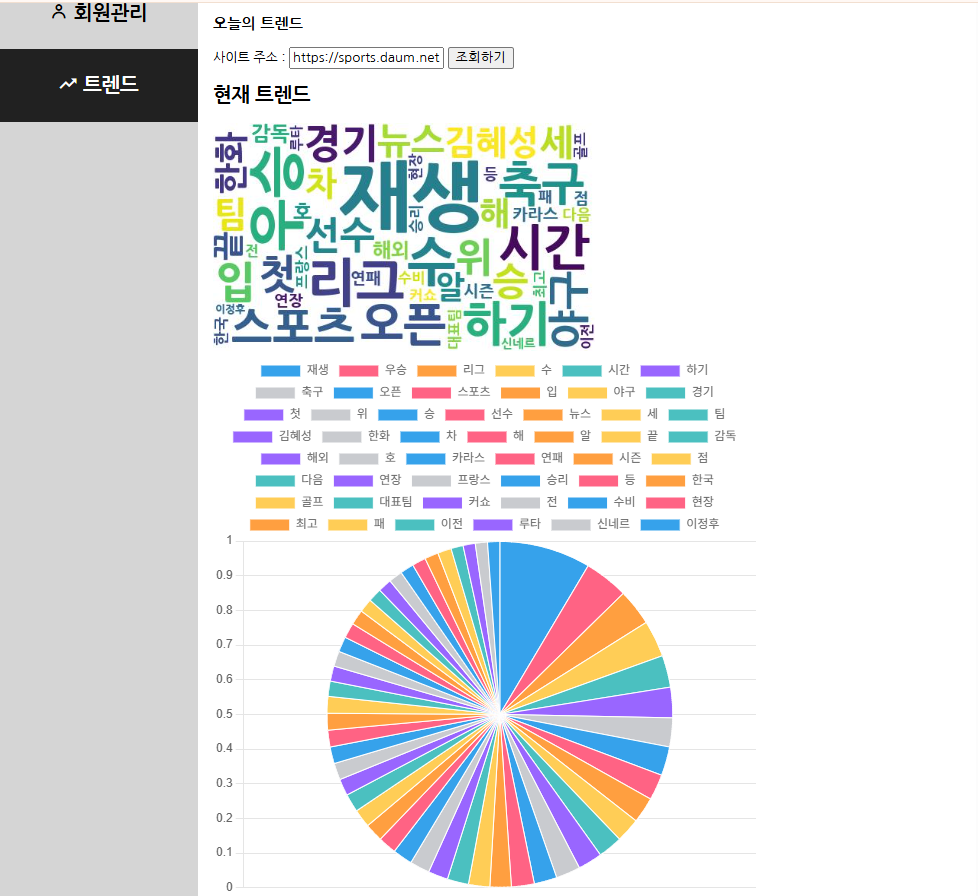
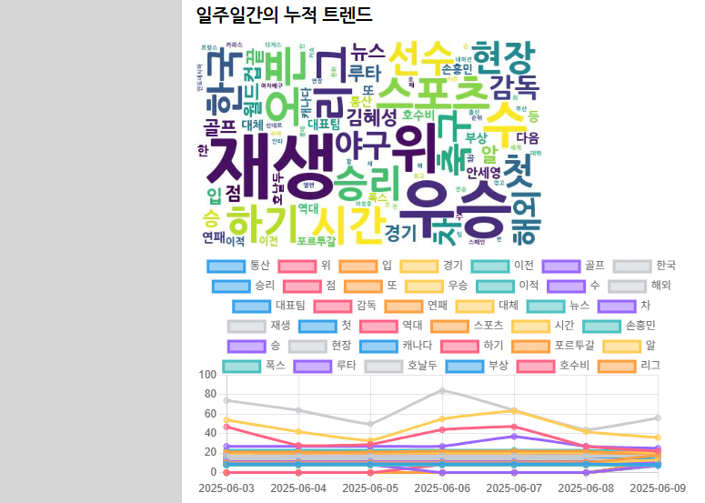
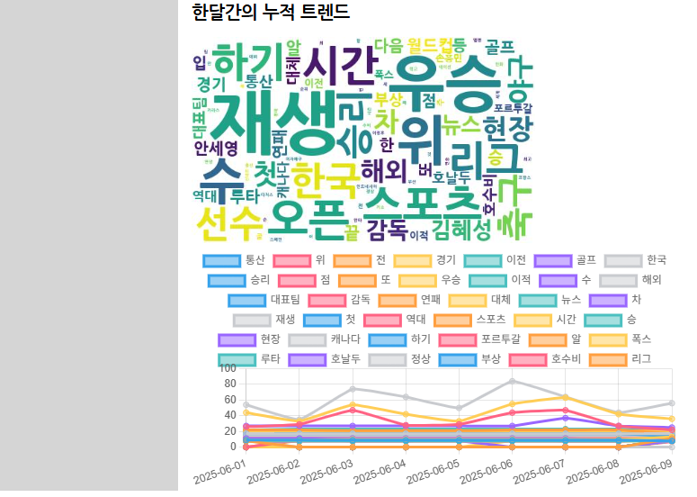
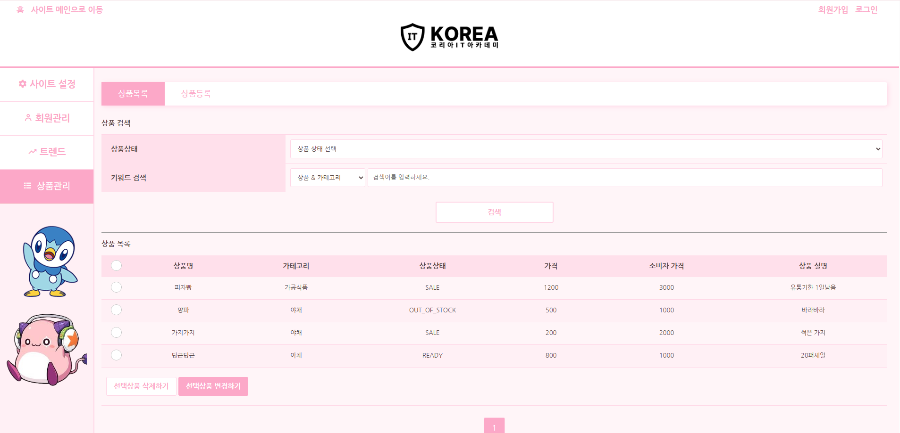

# 프로젝트 소개
# 1. 개요
- 프로젝트1 : 기간별 트렌드 분석 및 시각화 작업  

- 프로젝트2 : 등록된 상품 목록 출력 및 상품관리

# 2. 기획 이유 및 배경
## 트렌드
관리자에게 있어 트렌드를 아는 것은 중요할 것이다.  
하지만 관리자에게 필요한 트렌드가 오늘이 될지, 아니면 일주일 전이 될지 우리는 알 수 없다.  
관리자의 요청에 맞는 특정 기간 트렌드를 어떻게 조회할 수 있을까?  

## 상품
거래 게시판에서 상품을 등록을 했다면 등록 게시판을 구현 해야한다. 
등록된 상품을 게시판에 보여주는 것만으론 큰 의미가 없다. 
개인이 필요한 상품을 검색, 관리자에 의한 상품 상태 처리를 구현해보자!

# 3. 역할 분담
## 트렌드
- 김문수
  - url 치환코드 작성
  - 크롤링 관련 코드 작업
  - 워드클라우드 이미지 생성 관련 파이썬 파일 작업
  - README 파일 작성
- 이소민
  - 30일 데이터 크롤링 코드 작성
  - 화면 출력 작업
- 정호찬
  - 7일 데이터 크롤링 코드 작성
- 주예성
  - 30일 데이터 크롤링 코드 작성
  - 입력 url 관리 코드 작업
  - README 파일 작성
- 주용현
  - DB 테이블의 데이터를 조회하는 Repository Layer 작업
  - 트렌드 분석 기능을 제공하는 웹 컨트롤러 작업
  - 7일 데이터 크롤링 코드 작성
  - 트렌드 데이터 조회 코드 작업
  - README 파일 작성
- 송근호 
  - sevoce 작업
  - 상품 삭제 기능 작성 

## 상품검색,관리
- 김문수
  - 프로젝트 전체 통제(중재) 및 검수
    - service 테스트 및 오류 수정
    - html 기본 프레임 작성
- 이소민
  - html, css 작업
  - 상품검색, 목록 html 작업
- 정호찬
  - html, css 작업
  - 상품검색, 목록 html 작업
- 주예성
  - html, css 작업
  - 상품목록 css 작업
- 주용현
  - service 작업
  - 등록된 상품 목록, 페이지 기능, 검색 기능 service 작성
- 송근호
  - service 작업
  - 상품 삭제 기능 작성

# 4. 기능 설명

## 뉴스 트렌드 
- 네이버 뉴스(https://news.naver.com/) 오늘의 트렌드 데이터 조회
    - 데이터 조회 과정
      - 원격 컨텐츠 로드
      - 명사, 형용사, 동사의 단어로 형태소 분리
      - 가장 많이 등장하는 키워드를 상위 50개 추출
- 조회된 데이터를 워드클라우드 이미지화
- 조회된 데이터를 파이 그래프를 통해 시각화

## 트렌드 조회
- 검색한 url 웹 페이지의 정보를 크롤링 후 저장
- DB에 저장된 데이터를 기반하여 시각 정보를 제공
- 조회된 url 데이터를 기반으로 현재 트렌드 카테고리에 해당하는 DB데이터를 시각화(워드클라우드 이미지, 원 그래프)
- 저장된 일주일, 한 달 간의 누적 트렌드 데이터를 특정하여 시각화(워드클라우드 이미지, 꺽은선 그래프)

## 상품 목록
- 등록한 상품을 보여준다.

## 상품 검색
- 상품 목록에 있는 상품을 상품명, 카테고리를 통해 검색할 수 있게 해준다.

## 상품 삭제, 상태관리
- 상품 목록에서 상품 삭제 및 상태 변경을 한다.

# 5. 코드 리뷰

## TrendCrawlingService
- 입력한 url 웹 페이지의 정보를 크롤링하고 저장
    - ProcessBuilder로 외부 프로그램(Python)을 사용 → 크롤링(데이터 수집)
    - json 파일 형식으로 데이터 송수신

- TrendCrawling process
    - 주어진 search URL에 대해 크롤링을 실행하고, 결과 데이터를 JSON으로 받아 DB에 저장
      - trend.py 실행하여 해당 URL의 텍스트 수집 및 분석
      - TrendCrawling 객체로 결과 매핑
      - 결과를 Trend 엔티티로 변환하여 DB 저장
  
- String createWordCloud
    - 키워드 JSON 문자열을 받아 Python 스크립트를 실행하여 워드클라우드 이미지를 생성
      - JSON 해시값 기반으로 이미지 파일명 생성
      - word.py Python 스크립트 실행
      - trend/total 디렉토리에 이미지 저장

## TrendInfoService

- 최신, 7일간, 30일간 3가지 기간 별 트렌드 정보를 확인할 수 있도록 구현

- Trend getLatest
  - 지정된 카테고리의 최신 트렌드 데이터를 조회
- Trend get
  - 특정 날짜의 트렌드 데이터 1개 조회
- List<Trend> getList
  - 주어진 URL에 대해 트렌드 데이터를 수집하고, 일주일 및 한 달 단위 누적 트렌드를 생성
- Map<LocalDate, Map<String, Integer>> preprocessing
  - 트렌드 목록을 날짜별 키워드 빈도 평균 형태로 변환
- String getWordCloudPath
  - 전체 데이터를 기반으로 하나의 워드클라우드 이미지 생성
 
## ProductInfoService
- getList 메서드를 정의
  - 상품 페이지 기능 (page, limit, offset, total)
  - 상품 검색 기능 (sopt, skey)
- mapper 메서드를 정의
  - 데이터 베이스에 저장된 상품을 item에 저장하여 return
  - getList에 상품 객체를 넣어 줌(mapper)

## ProductManageService

- processBatch 메서드를 정의
  - 처리할 상품이 있을때 삭제처리 및 상태변경 처리 기능
  - 기존 회원 관리에서 사용한 방법이지만 다른 방식을 시도하여 실제로 사용은 안함.

## admin/product/list.html

- HTML form 태그의 action 속성을 설정
  
  - URL이 서버의 컨트롤러와 매핑되며, 프레임워크를 이용해 효율적으로 요청을 처리
- statusList라는 리스트를 순회하며 <option> 태그를 반복적으로 생성
  - 동적으로 리스트 데이터를 처리해, 코드 수정 없이도 상태 리스트를 손쉽게 업데이트 가능
- 각 상태 객체의 name() 메서드에서 반환된 값을 <option> 태그의 value 속성으로 설정
- 이전에 선택한 상태 값을 기준으로 <option> 태그에 selected 속성을 추가
- th:if 및 th:unless
  - "조회된 상품이 없습니다." 메시지를 표시
- th:value, th:text, th:name
  - th:value: 입력 요소의 값을 동적으로 설정
  - th:text: 요소 내 텍스트 콘텐츠를 설정
  - th:name: 입력 필드의 이름 속성을 동적으로 설정

## css
- 상남자의 색인 핑크테마 기반의 스타일
 - 기본 배경 : 연한 핑크 (#fff5f8)
 - 	링크 및 포인트 컬러 : 진한 핑크 (#fca8c8)
 -  펭귄 이미지 영역 (.product-footer-penguin): 관리자 메뉴 하단에 위치
 -  hover 시 배경색 변경 효과로 인터랙션 강조
 -  포커스 시 핑크 테두리와 그림자 효과
    

# 6. 구현 화면

## 오늘의 트렌드

## 지난 7일간의 트렌드

## 지난 30일간의 트렌드

## 상품 목록 관리자 페이지

